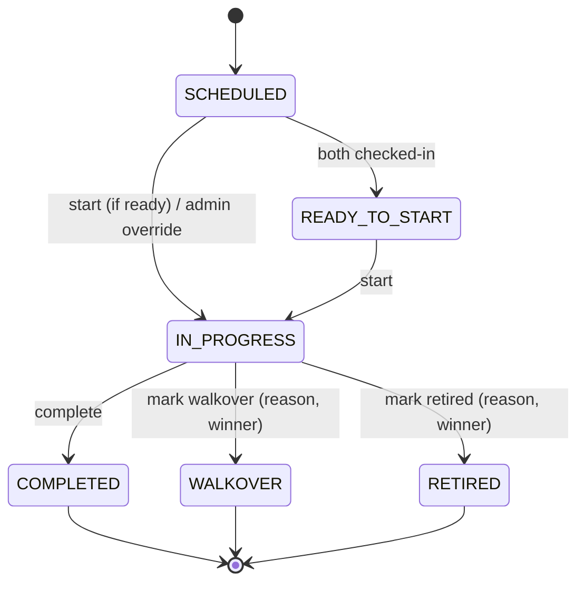

# Match Status Workflow (MVP) — Subagent Instructions

> **Scope guard:** This task implements **status state-machine only**. **Do not** add referee scoring or enhanced gameplay logic. Agents are free to **improvise prudently** to reduce complexity or improve UX/devex, provided MVP scope is preserved.

---

## 0) Shared Context & Goals
- **Why:** Status gates all critical actions (start match, mark walkover/retired, complete) and aligns Admin/User UIs.
- **Outcome:** Consistent state-machine across backend & UIs with clear permissions, validations, and simple UX.
- **States (MVP):** `SCHEDULED`, `READY_TO_START`, `IN_PROGRESS`, `COMPLETED`, `WALKOVER`, `RETIRED`.
- **Triggers:** Check-in events, Admin/Referee actions, and validations.

---

## 1) Database Architect
**Deliverables**
- Flyway migration adding/aligning columns in `match` (use actual table name):
  - `status VARCHAR(32) NOT NULL DEFAULT 'SCHEDULED'`
  - `status_reason TEXT NULL` (used for WALKOVER/RETIRED, optional notes)
  - `started_at TIMESTAMP NULL`
  - `ended_at TIMESTAMP NULL`
  - Index: `CREATE INDEX CONCURRENTLY IF NOT EXISTS idx_match_status ON match(status);`
- Ensure foreign keys already present (categoryId, courtId, participant refs) remain intact.
- Backfill script: set `status='SCHEDULED'` for existing rows where null.

**Notes**
- Use **idempotent** operations where possible; guard for multiple runs.
- Prefer `ENUM` in Java only; **do not** create DB enum to keep migrations simple.

---

## 2) Backend Architect
**Deliverables**
- Enum:
  ```java
  public enum MatchStatus {
      SCHEDULED, READY_TO_START, IN_PROGRESS, COMPLETED, WALKOVER, RETIRED
  }
  ```
- Entity updates: fields above + default `SCHEDULED`.
- **Domain rules** (Service layer):
  - Auto-transition to `READY_TO_START` when **both sides checked-in** (hooked via Check-In service or a small domain method invoked after each check-in change).
  - `SCHEDULED → IN_PROGRESS` only if both checked-in **or** ADMIN override.
  - `IN_PROGRESS → COMPLETED|WALKOVER|RETIRED` only; store `endedAt` when terminal.
  - Terminal states: `COMPLETED`, `WALKOVER`, `RETIRED` (no further transitions).
  - `WALKOVER/RETIRED` require `status_reason` (non-blank) and a winner reference recorded in existing winner field if present (or keep TBD if model not ready — document assumption).
- **Security:** add `@PreAuthorize("hasAnyRole('ADMIN','REFEREE')")` to mutation endpoints; read is open per current policy.

**Endpoints (proposed minimal)**
- `POST /api/v1/matches/{id}/start` → moves to `IN_PROGRESS` (validates readiness). Returns updated Match DTO.
- `POST /api/v1/matches/{id}/complete` → moves to `COMPLETED`.
- `POST /api/v1/matches/{id}/walkover` body `{ reason: string, winnerId: Long }` → `WALKOVER`.
- `POST /api/v1/matches/{id}/retired` body `{ reason: string, winnerId: Long }` → `RETIRED`.
- (Internal) `POST /api/v1/matches/{id}/ready` only for Admin if needed; otherwise reach `READY_TO_START` via check-in hook.

**DTOs**
- `MatchResponse`: add `status`, `statusReason`, `startedAt`, `endedAt`.
- `WalkoverRequest`, `RetiredRequest` with `reason`, `winnerId`.

**Errors**
- Illegal transitions → `409 CONFLICT` with machine-readable error code (`MATCH_ILLEGAL_TRANSITION`).
- Permission → `403 FORBIDDEN`.

**Integration Points**
- Expose a small domain method `updateReadyToStartIfEligible(matchId)` and call it from Check-In flow after toggle.

---

## 3) Backend Refactorer
**Deliverables**
- Extract transition logic into a dedicated component, e.g., `MatchStatusMachine` with pure functions:
  - `nextStatus(current, event, context) -> Validation<Result>`
- Unit-test this component in isolation; keep Services thin.
- Add constants for error codes; centralize exception mapping (e.g., `GlobalExceptionHandler`).

---

## 4) Backend Tester
**Deliverables**
- **Unit tests**: `MatchStatusMachineTest` (happy + sad paths).
- **Integration tests** (H2 + TestRestTemplate):
  - Start: `SCHEDULED → IN_PROGRESS` with/without check-ins.
  - Complete: `IN_PROGRESS → COMPLETED`.
  - Walkover/Retired require `reason` & (if model supports) `winnerId`.
  - Block: illegal transitions (e.g., `SCHEDULED → COMPLETED`).
  - Security: 403 for `USER` role on mutation endpoints.
- Seed data: demo match in each initial state pathway.

**Reporting**
- Provide a concise test matrix and coverage summary.

---

## 5) Admin UI Engineer
**Deliverables**
- In **Matches DataGrid / Details Drawer**:
  - Show **Status Chip** (`SCHEDULED`, `READY`, `LIVE`, `COMPLETED`, `W/O`, `RETIRED`).
  - Action buttons (visible for `ADMIN|REFEREE` only): **Start**, **Complete**, **Walkover**, **Retired**.
  - Disable buttons based on current state (e.g., Start disabled unless `SCHEDULED` or `READY_TO_START`).
- Implement API calls to endpoints above; optimistic UI update or refetch on success.
- Confirmation dialogs for terminal transitions with textarea for `reason` (W/O, Retired).

**Notes**
- Placeholders only; **do not** add point-by-point scoring.

---

## 6) Admin UI Refactorer
**Deliverables**
- Extract a reusable `<MatchStatusChip status={...} />` with consistent colors/icons.
- Centralize API client methods and error handling (toast + inline explanation on 409/403).
- Ensure Guarded Routes / component-level guard to hide actions for non-permitted roles.

---

## 7) User UI Engineer
**Deliverables**
- Read-only status presentation on public match cards and match detail page.
- If already scheduled, show "LIVE" when `IN_PROGRESS`, and terminal label when complete.
- Provide a **lightweight refresh** (manual refresh or refetch on focus). Live sockets are V2.

---

## 8) UX/UI Designer (Improve current UI within task scope)
**Deliverables**
- Status tokens design system:
  - Colors & icons (accessible contrast):
    - `SCHEDULED` (Neutral), `READY_TO_START` (Info), `IN_PROGRESS` (Primary), `COMPLETED` (Success), `WALKOVER` (Warning), `RETIRED` (Warning/Orange).
  - Chip sizes: compact & regular; consistent spacing in DataGrid.
- Action placement & microcopy:
  - Button labels: **Start Match**, **Complete Match**, **Mark Walkover**, **Mark Retired**.
  - Dialog copy: concise, with irreversible action warning for terminal states.
- Empty/loading/error states patterns for match detail panel.
- Provide a one-page **UI spec** (Figma or markdown) with examples.

Agents may **improvise** to improve clarity (icons, spacing, copy) but must not extend scope into scoring UI, timers, or socket live-updates.

---

## 9) Documentation Writer
**Deliverables**
- **Implementation Status Document** (markdown in `docs/`), sections:
  1. **Overview & Rationale**
  2. **State Machine Diagram** (Mermaid) and transition table
  3. **API Contracts** (requests/responses, codes)
  4. **Security Model** (roles → actions)
  5. **DB Migration Notes**
  6. **Test Matrix & Results**
  7. **Known Limitations** & V2 handoff (Enhanced Scoring)
- Update Swagger/OpenAPI with new endpoints and fields.

Provide a concise **Changelog** entry and add links to PRs.

---

## 10) Project Manager
**Deliverables**
- Break down into PRs:
  1. DB migration & entity enum + basic status field
  2. Service & endpoints + unit tests
  3. UI Admin actions + chips
  4. User UI read-only
  5. Docs
- Definition of Done per PR:
  - Tests passing, Swagger updated, review checklist, screenshot/gif of UI change.
- Timeline: aim for 2–3 days total elapsed with parallel UI/backend work.

---

## 11) Acceptance Criteria (MVP)
- Status transitions enforced exactly as defined; illegal transitions return **409**.
- `READY_TO_START` auto-derives from double check-in; admin override allowed.
- Only `ADMIN`/`REFEREE` can change status (403 otherwise).
- Admin UI shows correct chips and enables only valid actions.
- User UI reflects status clearly and updates on user-triggered refresh.
- Docs include state diagram, API, tests, and limitations.

---

## 12) Out-of-Scope (Defer to V2)
- Point-by-point scoring, deuce logic, timers, service indicators, undo.
- Live sockets/SSE for real-time updates.
- Referee assignment/rosters and dashboards.

---

## 13) Handoff Notes & Improvisation Policy
- Agents may simplify names, extract utilities, or slightly adjust API shapes if it **reduces complexity** and **keeps contracts stable** for Admin/User UI.
- Any deviation from this spec should be added to the **Implementation Status Document** under **“Decisions & Deviations.”**

---

### Quick Mermaid State Diagram (for docs reuse)


---

## 14) Post-Completion Checklist
- [ ] All PRs merged with green CI
- [ ] Swagger published
- [ ] **Implementation Status Document** committed to `docs/` and linked in README
- [ ] Demo script updated for MVP run-through
- [ ] Handoff notes for V2: Enhanced Scoring

